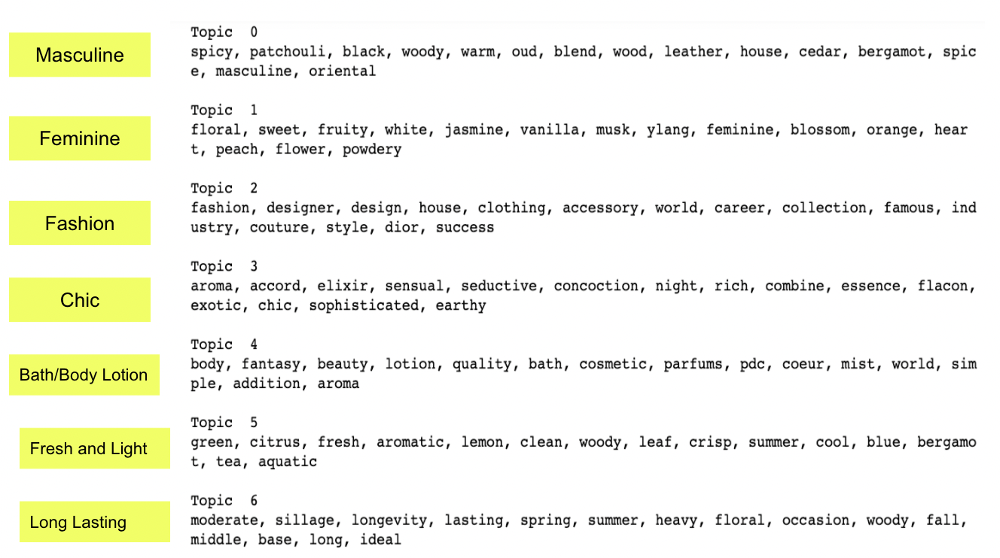
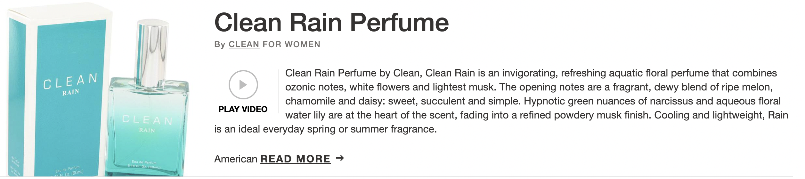
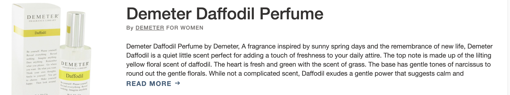
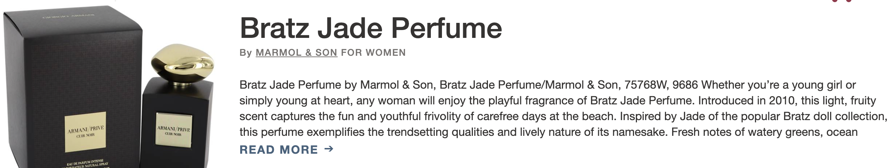

The goal of this project is trying to build a content based perfume recommendation system for [Fragrancex]('https://www.fragrancex.com/'). And this recommendation engine will be built based on topic modelings.

I built my model by using NMF, and I ended up getting 7 topics:

Initial version of recommendation engine:

* Input = 'Sunny'

Clean Rain Perfume

Demeter Daffodil Perfume

Backyardigans

