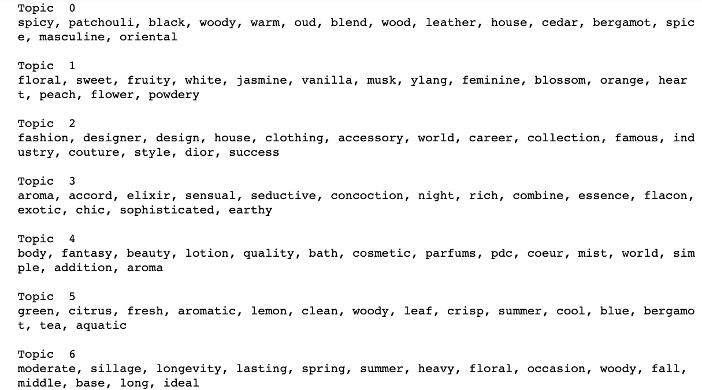
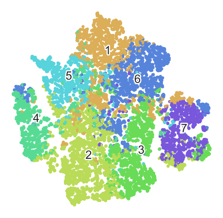
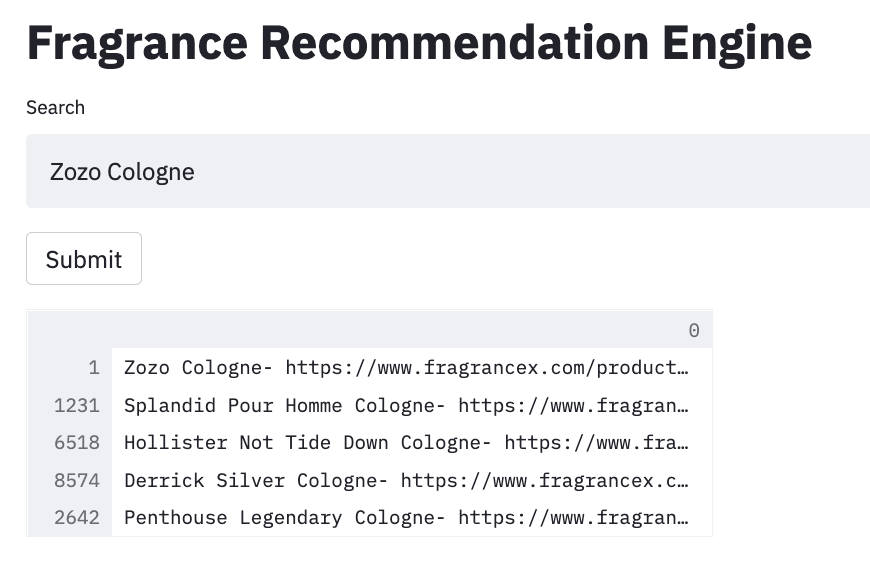

# NLP: Fragrance Recommendation System
Wenting Deng

##Abstract
The goal of this project was to build a content-based recommendation system for FragranceX, an online retailer which sells a large selections of fragrances. The data I worked with were scrapped from [FragranceX.com](https://www.fragrancex.com/). It contains 14,187 unique listings and their product descriptions. The recommendation system was built based on topic modeling by using NMF. And a simple version of APP was built by using Streamlit.

##Design
This project could help FragranceX address two applications. On the company side, the topic modeling helps understand the diversity of their products. On the consumer end, the recommendation system recommends more options, it could potentially drive more sales and improve customer experience.

##Data
The data were scrapped from [FragranceX.com](https://www.fragrancex.com/). It contains 14,187 unique listings on the website. It includes product names, listing urls, product descriptions and product review scores. And the average length of each product description is 150 words after excluding punctuations and numbers.

##Algorithms
**NLP**
NLP was conducted on product descriptions:
1. Vectorize text by TfidfVectorizer, and convert the data into doc-term matrix
2. Clean up the matrix by removing stopwords, applying lemmatization and POS tags for dimensionality reductions.

**Topic Modeling**
3. Conduct topic modeling by using NMF and LSA. And choose NMF as the final model as it produces most clear and distinct topics.

NMF: 7 topics

Topic 1 Woody
Topic 2 Floral
Topic 3 Fashion/Popular
Topic 4 Oriental
Topic 5 Simple
Topic 6 Fresh
Topic 7 Long Lasting

**Recommendation System**
4. Create content-based recommendation system by calculation similarity scores on doc-topic matrix which gets in step 3.

The logic of recommendation system as below:
* If the user searches a brand name, it will return 5 items with highest product review scores;
* If the user searches a particular product name, it will return the product with other 4 most similar items;
* If the user searches other words, it will return 5 most relevant items based on similarity scores.

**Model Test**
Because it's an unsupervised model which we don't have a standard metric to test its performance. The topic model was evaluated by human sense and the recommendation system was tested by other users.

##Communication##
Slides
